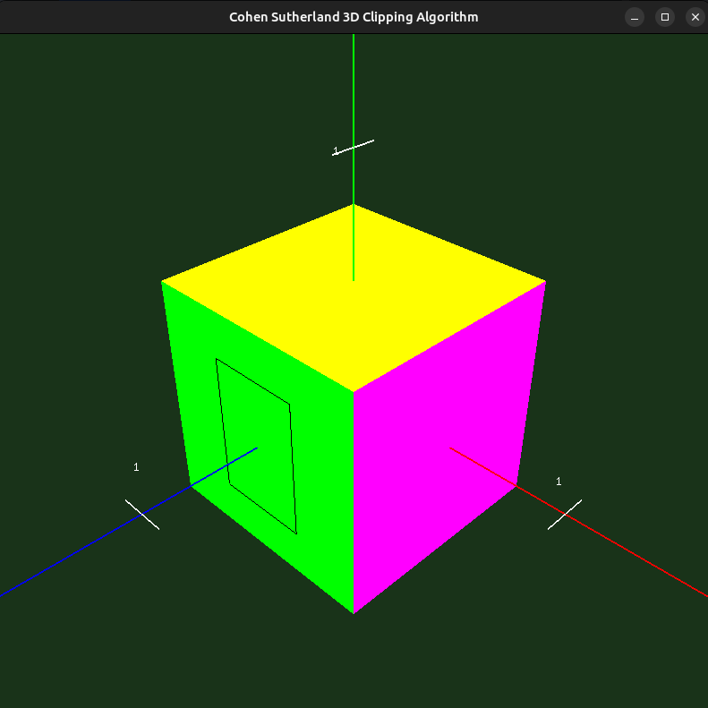
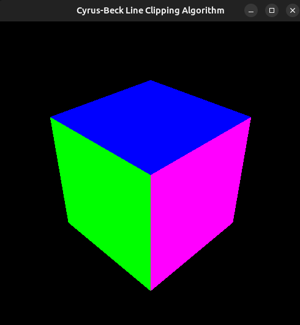
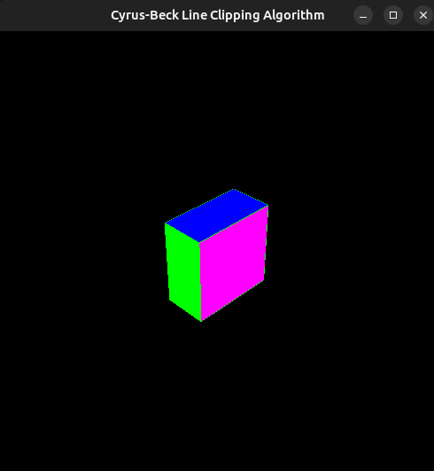

# 3D Polygon Clipping

## Questions

1. Illustrate with working example the concept of 3D clipping and viewing
2. Illustrate how the Cohen-Sutherland and Cyrus-Beck are applied in 3D clipping of the image below using Open GL.

## Output Images
### 1. Example
a. Example before cliping  
.png)  
b. Example after cliping view 1  
.png)
c. Example after cliping view 2  
.png)
d. Example after cliping view 3  
.png)

### 2. Cohen Sutherland
a. Example before cliping  

b. Example after cliping view 1  
.png)

c. Example after cliping view 2  
.png)

3. Cyrus Beck
a. Example before cliping  

b. Example after cliping view 1  
